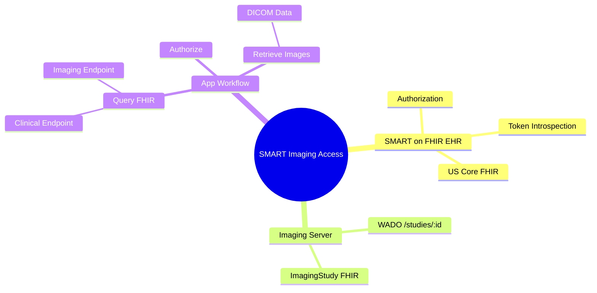

# Introduction

The SMART Imaging project aims to provide a unified solution for accessing imaging studies alongside clinical data using a single authorization flow. This enables patients to have better access to their data, facilitates second opinions, streamlines data donations for research, and supports providers in their analysis with preferred tools and specialty-specific viewers.

This project builds on the Sync for Science (S4S) Imaging Specs, which were developed by the SMART team for the NIH All of Us program. It seeks to refine and implement these specifications and integrate them with the SMART on FHIR authorization, token introspection, and clinical APIs.

### Mind map of key concepts



# Getting Started

Try the SMART Imaging Demo Stack live at;

* https://imaging-app.argo.run is a Demo SMART Imaging App that can connect to any SMART on FHIR Clinical + Imaging endpoints.

* https://imaging.argo.run/smart-sandbox/fhir/ImagingStudy is a SMART on FHIR FHIR Imaging endpoint. Note that `smart-sandbox` can be replaced with other configuration keys to change server behavior. See <a href="#config">config section</a> below.

## Prerequisites

To work with the SMART Imaging project, you should have the following prerequisites:

* Knowledge of [SMART, OAuth2, and token introspection](https://hl7.org/fhir/smart-app-launch/)

* Familiarity with [FHIR](https://hl7.org/fhir/) and [DICOM](https://www.dicomstandard.org/current) standards 


 

# Understanding the SMART Imaging Demo Stack


The SMART Imaging demo stack includes two main components:

## Sample app

See [`./viewer`](./viewer).

This app connects a SMART on FHIR clinical data server (e.g., an EHR sandbox) as well as an imaging erver (e.g., our Reference Imaging Server). After authorization, it retrieves data from both. 


<a id="config"></a>
## Reference Imaging Server (FHIR + DICOM)

See [`./server`](./server).

### Flexible Behaviors

The Reference Imaging Server allows for testing SMART Imaging with many different servers. A complete configuration will provide two key components:

* Authorization server. Typically this will be an EHR's existing SMART on FHIR server (e.g., an EHR's sandbox authz server).
* Image source. Typically this will be a DICOM Web server that supports some kind of private authentication, but it could be something simpler like a folder full of test images in a demo environmnet. Anything that can recive a Patient and output a set of DICOM metadata + images.

### Pre-specified configurations (`https://imaging.argo.run/:key/fhir`) 

Pre-specified configurations are controlled by files in [`./server/config`](./server/config). They can change the behavior of the server to help you test out specific scenarios. For example:

  * `/smart-sandbox` configuration is backed by [`./server/config/smart-sandbox.json`](./server/config/smart-sandbox.json), which means that it will introspect access tokens against SMART's sandbox authorization server, so clients must use https://launch.smarthealthit.org to get an access token before making imaging requests.
  * `/open` configuration is backed by [`./server/config/open.json`](./server/config/open.json), which means that it will ignore access tokens entirely an just use a hard-coded introspection response. Similarly, it will ignore patient matching and always return the same set of images. These behaviors can be very handy for debugging.
  * For other keys, see [`./server/config`](./server/config)

### Dynamic Configuration (`https://imaging.argo.run/dyn/:encoded/fhir`) 

Dynamic configurations are useful when you want to get started testing SMART Imaging with your own EHR's authorization server. You can rapidly iterate on your config settings until you get something that works. These paths start with  `/dyn/:encoded`, where the variable component is `base64urlencode(JSON.stringify(config))`. For example, you might test out configurations dynamically until you're happy with the behavior; then you might email a few colleagues your base URL so they can test things out, and eventually you might submit a PR to this repository so a wider audience can reproduce this behavior.

#### Example of `/dyn/:encoded`

Here's an example of how to encode your config settings. (You can try this yourself in a [Deno REPL](https://deno.land/manual/getting_started/installation).)
```
import {encode} from "https://deno.land/std@0.179.0/encoding/base64url.ts";

const ex = {
  "authorization": {
    "type": "fake-authorization",
    "ignorePatient": true,
  },
  "images": {
    "type": "dicom-web",
    "lookup":  "all-studies-on-server",
    "endpoint": "https://myserver.example.org/dicom-web",
    "authentication": {
      "type": "http-basic",
      "username": "argonaut",
      "password": "argonaut"
    }
  }
}
console.log(encode(JSON.stringify(ex)))
```

This gives you an `encoded` value of:

    eyJhdXRob3JpemF0aW9uIjp7InR5cGUiOiJmYWtlLWF1dGhvcml6YXRpb24iLCJpZ25vcmVQYXRpZW50Ijp0cnVlfSwiaW1hZ2VzIjp7InR5cGUiOiJkaWNvbS13ZWIiLCJsb29rdXAiOiJhbGwtc3R1ZGllcy1vbi1zZXJ2ZXIiLCJlbmRwb2ludCI6Imh0dHBzOi8vbXlzZXJ2ZXIuZXhhbXBsZS5vcmcvZGljb20td2ViIiwiYXV0aGVudGljYXRpb24iOnsidHlwZSI6Imh0dHAtYmFzaWMiLCJ1c2VybmFtZSI6ImFyZ29uYXV0IiwicGFzc3dvcmQiOiJhcmdvbmF1dCJ9fX0


## Technologies under the hood

* **TypeScript**: A superset of JavaScript that adds static typing, enabling better tooling and improved code quality. Find more information at the [TypeScript website](https://www.typescriptlang.org/)

* **Deno**: A secure runtime for JavaScript and TypeScript, built with V8, Rust, and Tokio. Learn more at the [Deno website](https://deno.land/)

* **Svelte**: A modern, lightweight, and component-based JavaScript framework for building user interfaces. Explore more at the [Svelte website](https://svelte.dev/)

* **Minikube**: A tool that runs a single-node Kubernetes cluster locally, making it easy to learn and develop for Kubernetes. Check out the [Minikube GitHub repository](https://github.com/kubernetes/minikube) for more details.

* **Docker**: A platform for developing, shipping, and running applications in containers, enabling consistent environments and easier deployment. Find more information at the [Docker website](https://www.docker.com/)

# Contributing

We welcome contributions from the community to help improve and expand the SMART Imaging project. To contribute, follow these guidelines:

1. Fork the repository and create a new branch for your feature or bugfix.

2. Develop your changes, ensuring that you follow the existing code style and best practices.

3. Test your changes thoroughly and verify that they work correctly.

4. Submit a pull request, detailing the changes you've made and their purpose.

# License and Credits

This project is licensed under the Apache License, Version 2.0. Credits for third-party libraries and resources used in the project can be found in the NOTICE file.


# Support and Contact Information

If you have questions, need assistance, or want to provide feedback on the SMART Imaging project, please visit #argonaut on https://chat.fhir.org, or open an issue in this repository.

---
  
# Development Setup with minikube

This section provides a step-by-step guide for setting up the SMART Imaging project on your local machine using Minikube. Following these instructions will help you create a local development environment, which is essential for testing and making changes to the project before deploying it to a production environment.

1. Install `minikube` locally (tested with version 1.29)
2. Install `mkcert` locally (tested with 1.4.4)

```
minikube start
mkcert -install  "*.imaging-local.argo.run" "imaging-local.argo.run"
kubectl -n kube-system create secret tls mkcert \
    --key _wildcard.argo.run-key.pem \
    --cert _wildcard.argo.run.pem
minikube addons configure ingress # enter 'kube-system/mkcert'
minikube addons enable ingress
echo $(minikube ip)    imaging-local.argo.run | sudo tee -a /etc/hosts
echo $(minikube ip)    launcher.imaging-local.argo.run | sudo tee -a /etc/hosts
eval $(minikube -p minikube docker-env)

git clone https://github.com/smart-on-fhir/smart-launcher-v2
cd smart-launcher-v2
docker build -t argonautcontainerregistry.azurecr.io/smartonfhir/smart-launcher-2 .
cd ..

git clone https://github.com/jmandel/smart-imaging-api
cd smart-imaging-api
docker build -t argonautcontainerregistry.azurecr.io/imaging-proxy .

kubectl apply -f k8s/base.yml -f k8s/minikube.yml
```


## Access Services

* Open https://imaging-local.argo.run for SMART Launcher
* Open https://imaging-local.argo.run/orthanc (argonaut/argonaut) for Orthanc instance underlying the demo
* API at https://imaging-local.argo.run/img/smart-sandbox-local/fhir/ImagingStudy?patient= to query for imaging data

### Local API examples

This `curl` command queries the SMART Imaging API for ImagingStudy resources associated with a specific patient (identified by their ID) and retrieves the data in the FHIR format. The API endpoint is in the `open` configuration, which means it does not require any access tokens for authentication, which is useful for debugging and development.

```
curl https://imaging-local.argo.run/open/fhir/ImagingStudy?patient=Patient/87a339d0-8cae-418e-89c7-8651e6aab3c6
```

## After building new images

```
kubectl  -n smart-imaging-access rollout restart deployment reference
```

# Deploying to hosted demo

Deploying to a hosted demo into a public kubernetes cluster allows you to showcase the project to a wider audience, test its functionality in a production-like setting, and gather valuable user feedback for future improvements.

```
kubectl apply -f k8s/base.yml k8s/server.yml
```
