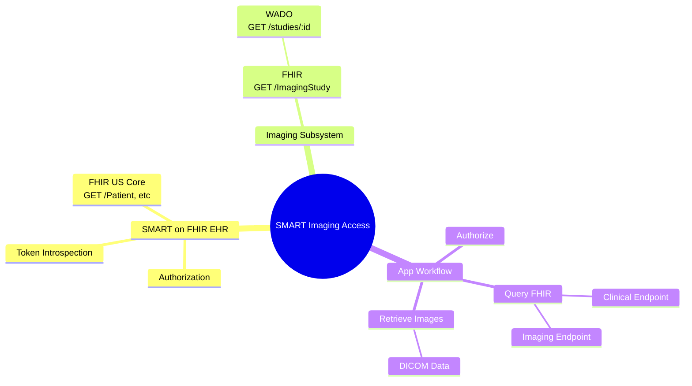
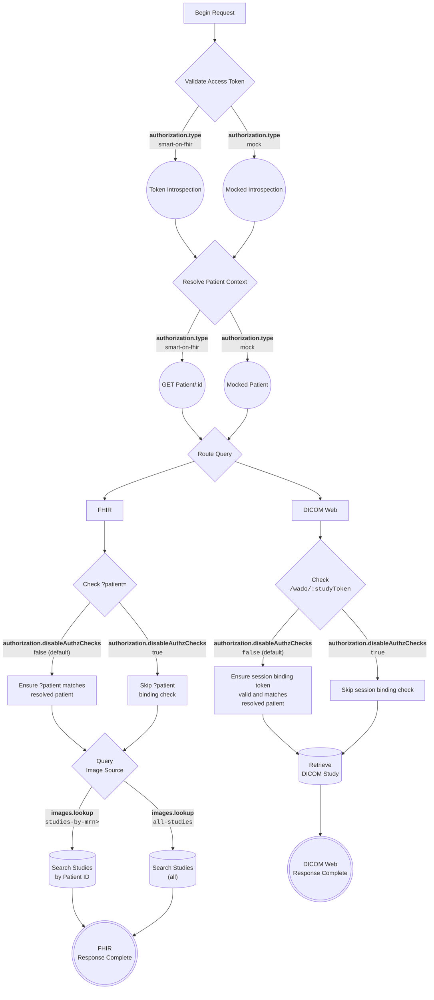

# Introduction

The SMART Imaging project aims to provide a unified solution for accessing imaging studies alongside clinical data using a single authorization flow. This enables patients to have better access to their data, facilitates second opinions, streamlines data donations for research, and supports providers in their analysis with preferred tools and specialty-specific viewers.

This project builds on the [Sync for Science (S4S) Imaging Specs](https://github.com/sync-for-science/imaging), which were developed by the SMART team for the NIH *All of Us* research program.

### Mind map of key concepts


```mermaid
mindmap
  root((SMART Imaging Access))
    SMART on FHIR EHR
      Authorization
      Token Introspection
      FHIR US Core<br>GET /Patient, etc
    Imaging Subsystem
      FHIR<br>GET /ImagingStudy
        WADO<br>GET /studies/:id
    App Workflow
      Authorize
      Query FHIR
        Clinical Endpoint
        Imaging Endpoint
      Retrieve Images
        DICOM Data
```

# Getting Started

Try the SMART Imaging Demo Stack live:

* https://imaging.argo.run/app/viewer/ is the Demo SMART Imaging App served from the stack. The same React app can also be deployed as a static site, with its server list edited in the browser Settings panel.

* https://imaging.argo.run/smart-sandbox/fhir/ImagingStudy is a SMART on FHIR FHIR Imaging endpoint. Note that `smart-sandbox` can be replaced with other configuration keys to change server behavior. See <a href="#config">config section</a> below.

## Prerequisites

To work with the SMART Imaging project, you should have the following prerequisites:

* Knowledge of [SMART, OAuth2, and token introspection](https://hl7.org/fhir/smart-app-launch/)

* Familiarity with [FHIR](https://hl7.org/fhir/) and [DICOM](https://www.dicomstandard.org/current) standards  

# Understanding the SMART Imaging Demo Stack


The SMART Imaging demo stack includes two main components:

## Sample app

See [`./viewer`](./viewer).

This React app connects a SMART on FHIR clinical data server (e.g., an EHR sandbox) as well as an imaging server (e.g., our Reference Imaging Server). After authorization, it retrieves clinical data from the EHR and imaging studies through the configured imaging API. The app can load a mounted runtime config from `config/config.json`, fall back to its bundled `servers.json`, and lets users edit settings in the browser.


<a id="config"></a>
## Reference Imaging Server (FHIR + DICOM)

See [`./server`](./server).

### Flexible Behaviors

The Reference Imaging Server allows for testing SMART Imaging with many different servers. A complete configuration will provide two key components:

* Authorization server. Typically this will be an EHR's existing SMART on FHIR server (e.g., an EHR's sandbox authz server).
* Image source. Typically this will be a DICOM Web server that supports some kind of private authentication, but it could be something simpler like a folder full of test images in a demo environment. Anything that can receive a Patient and output a set of DICOM metadata + images.

### Query Flow Through the Reference Imaging Server


```mermaid
flowchart TB
    A[Begin Request] --> AccessTokenValidation{Validate Access Token}
    AccessTokenValidation -->|<b>authorization.type</b><br>smart-on-fhir| TokenIntrospection((Token Introspection))
    AccessTokenValidation -->|<b>authorization.type</b><br>mock| MockIntrospection((Mocked Introspection))
    TokenIntrospection --> ResolvePatientContext{Resolve Patient Context}
    MockIntrospection --> ResolvePatientContext
    ResolvePatientContext -->|<b>authorization.type</b><br>smart-on-fhir| GetPatient((GET Patient/:id))
    ResolvePatientContext -->|<b>authorization.type</b><br>mock| MockResolver((Mocked Patient))

    GetPatient --> RouteQuery{Route Query}
    MockResolver --> RouteQuery

    RouteQuery --> FHIRQuery[FHIR]
    RouteQuery --> DICOMQuery[DICOM Web]

    FHIRQuery --> CheckFHIRPatientBinding{Check ?patient=}
    CheckFHIRPatientBinding -->|"<b>authorization.disableAuthzChecks</b><br>false (default)"| EnsurePatientProperty[Ensure ?patient matches<br>resolved patient]
    CheckFHIRPatientBinding -->|<b>authorization.disableAuthzChecks</b><br>true| SkipPatientBindingCheck[Skip ?patient<br>binding check]
    EnsurePatientProperty --> RespondToFHIRQueries{Query<br>Image Source}
    SkipPatientBindingCheck --> RespondToFHIRQueries
    RespondToFHIRQueries -->|"<b>images.lookup</b><br><code>studies-by-mrn>"| PatientBinding[(Search Studies<br>by Patient ID)]
    RespondToFHIRQueries -->|"<b>images.lookup</b><br><code>all-studies</code>"| AllStudiesOnServer[("Search Studies<br>(all)")]

    PatientBinding --> FHIRResponseComplete(((FHIR<br>Response Complete)))
    AllStudiesOnServer --> FHIRResponseComplete

    DICOMQuery --> CheckDICOMSessionBinding{Check<br><code>/wado/:studyToken</code>}
    CheckDICOMSessionBinding -->|"<b>authorization.disableAuthzChecks</b><br><code>false</code> (default)"|CheckSessionBindingToken[Ensure session binding token<br>valid and matches<br>resolved patient]
    CheckDICOMSessionBinding -->|"<b>authorization.disableAuthzChecks</b><br><code>true</code>"| SkipSessionBindingCheck[Skip session binding check]
    CheckSessionBindingToken --> DICOMWebResponseGeneration[(Retrieve<br>DICOM Study)]
    SkipSessionBindingCheck --> DICOMWebResponseGeneration
    DICOMWebResponseGeneration --> DICOMWebResponseComplete(((DICOM Web<br>Response Complete)))

```


### Pre-specified configurations (`https://imaging.argo.run/:key/fhir`) 

Pre-specified configurations are controlled by files in [`./server/config`](./server/config). They can change the behavior of the server to help you test out specific scenarios. For example:

  * `/smart-sandbox` configuration is backed by [`./server/config/smart-sandbox.json`](./server/config/smart-sandbox.json), which means that it will introspect access tokens against SMART's sandbox authorization server, so clients must use https://launch.smarthealthit.org to get an access token before making imaging requests.
  * `/open` configuration is backed by [`./server/config/open.json`](./server/config/open.json), which means that it will ignore access tokens entirely and just use a hard-coded introspection response. Similarly, it will ignore patient matching and always return the same set of images. These behaviors can be very handy for debugging.
  * For other keys, see [`./server/config`](./server/config)

### Dynamic Configuration (`https://imaging.argo.run/dyn/:encoded/fhir`) 

Dynamic configurations are useful when you want to get started testing SMART Imaging with your own EHR's authorization server. You can rapidly iterate on your config settings until you get something that works. These paths start with  `/dyn/:encoded`, where the variable component is `base64urlencode(JSON.stringify(config))`. For example, you might test out configurations dynamically until you're happy with the behavior; then you might email a few colleagues your base URL so they can test things out, and eventually you might submit a PR to this repository so a wider audience can reproduce this behavior.

#### Example of `/dyn/:encoded`

You can easily create your own dynamically configured endpoint using

* Code like the snippet below (runnable in [Deno REPL](https://deno.land/manual/getting_started/installation))

```ts
import {encode} from "https://deno.land/std@0.179.0/encoding/base64url.ts";

const ex = {
  "authorization": {
    "type": "mock",
    "disableAuthzChecks": true,
  },
  "images": {
    "type": "dicom-web",
    "lookup":  "all-studies-on-server",
    "endpoint": "https://myserver.example.org/dicom-web",
    "authentication": {
      "type": "http-basic",
      "username": "argonaut",
      "password": "argonaut"
    }
  }
}
console.log(encode(JSON.stringify(ex)))
```

This gives you an `encoded` value.

    eyJhdXRob3JpemF0aW9uIjp7InR5cGUiOiJtb2N...


## Technologies under the hood

* **TypeScript**: A superset of JavaScript that adds static typing, enabling better tooling and improved code quality. Find more information at the [TypeScript website](https://www.typescriptlang.org/)

* **Deno**: A secure runtime for JavaScript and TypeScript, built with V8, Rust, and Tokio. Learn more at the [Deno website](https://deno.land/)

* **React + Vite**: The sample viewer is a React app built with Vite and served either as static files or from the reference stack at `/app/viewer/`.

* **Minikube**: A tool that runs a single-node Kubernetes cluster locally, making it easy to learn and develop for Kubernetes. Check out the [Minikube GitHub repository](https://github.com/kubernetes/minikube) for more details.

* **Docker**: A platform for developing, shipping, and running applications in containers, enabling consistent environments and easier deployment. Find more information at the [Docker website](https://www.docker.com/)

# Contributing

We welcome contributions from the community to help improve and expand the SMART Imaging project. To contribute, follow these guidelines:

1. Fork the repository and create a new branch for your feature or bugfix.

2. Develop your changes, ensuring that you follow the existing code style and best practices.

3. Test your changes thoroughly and verify that they work correctly.

4. Submit a pull request, detailing the changes you've made and their purpose.

# License and Credits

This project is licensed under the Apache License, Version 2.0. Credits for third-party libraries and resources used in the project can be found in the NOTICE file.


# Support and Contact Information

If you have questions, need assistance, or want to provide feedback on the SMART Imaging project, please visit #argonaut on https://chat.fhir.org, or open an issue in this repository.

---
  
# Development Setup with minikube

This section sets up a local Kubernetes stack with the React viewer, reference imaging API, Orthanc, and SMART launcher. It was last verified with `minikube v1.38.1`, Kubernetes `v1.35.1`, and `mkcert 1.4.x`.

Install these tools first:

* `minikube`
* `kubectl`
* `docker`
* `mkcert`
* Node.js and `npm` if you want to run the viewer outside Docker

Start minikube and make sure `kubectl` is pointed at it:

```sh
minikube start
minikube addons enable ingress
kubectl config use-context minikube
```

If you are reusing a very old minikube profile and Kubernetes certificate errors prevent startup, recreate the local cluster with `minikube delete` and then run `minikube start` again. This deletes only the local minikube cluster.

Create a local TLS certificate for the minikube host names:

```sh
mkcert -install
mkcert \
  -key-file imaging-local-key.pem \
  -cert-file imaging-local-cert.pem \
  "*.imaging-local.argo.run" \
  "imaging-local.argo.run"
```

Point the local host names at the minikube IP:

```sh
minikube ip
```

Add these names to `/etc/hosts`, replacing `192.168.49.2` with the IP from `minikube ip`:

```text
192.168.49.2 imaging-local.argo.run launcher.imaging-local.argo.run
```

Build the reference server image inside minikube's Docker daemon. The Dockerfile builds the React viewer and copies the generated `viewer/dist` output into the final server image, so generated `server/public` files should not be committed.

```sh
eval "$(minikube -p minikube docker-env)"
docker build -f server/Dockerfile -t ghcr.io/jmandel/smart-imaging-proxy:latest .
```

Deploy the stack:

```sh
kubectl apply -f server/k8s/base.yml
kubectl -n smart-imaging-access create secret tls imaging-local-tls \
  --cert=imaging-local-cert.pem \
  --key=imaging-local-key.pem \
  --dry-run=client \
  -o yaml | kubectl apply -f -
kubectl apply -f server/k8s/minikube.yml
kubectl -n smart-imaging-access rollout status deployment/orthanc
kubectl -n smart-imaging-access rollout status deployment/launcher
kubectl -n smart-imaging-access rollout status deployment/reference
```

The minikube ingress uses an `imaging-local-tls` secret in the `smart-imaging-access` namespace. Older instructions configured an ingress addon default certificate in `kube-system`; the current manifests keep the TLS wiring explicit in the app namespace.


## Access Services

* Open https://imaging-local.argo.run/app/viewer/ for the SMART Imaging viewer
* Open https://launcher.imaging-local.argo.run for SMART Launcher
* Open https://imaging-local.argo.run/orthanc (argonaut/argonaut) for Orthanc instance underlying the demo
* API at https://imaging-local.argo.run/open/fhir/ImagingStudy?patient= to query for imaging data

### Local API examples

This `curl` command queries the SMART Imaging API for ImagingStudy resources associated with a specific patient (identified by their ID) and retrieves the data in the FHIR format. The API endpoint is in the `open` configuration, which means it does not require any access tokens for authentication, which is useful for debugging and development.

```
curl https://imaging-local.argo.run/open/fhir/ImagingStudy?patient=Patient/87a339d0-8cae-418e-89c7-8651e6aab3c6
```

## Smoke test

After the pods are ready, run:

```sh
deploy/smoke-test.sh https://imaging-local.argo.run https://imaging-local.argo.run/orthanc
```

## After viewer or server changes

For viewer or server changes, rebuild the server image in minikube and restart the reference deployment. The image build will rebuild the viewer.

```sh
eval "$(minikube -p minikube docker-env)"
docker build -f server/Dockerfile -t ghcr.io/jmandel/smart-imaging-proxy:latest .
kubectl -n smart-imaging-access rollout restart deployment/reference
kubectl -n smart-imaging-access rollout status deployment/reference
```

# Deploying to hosted demo

Deploying to a hosted demo into a public Kubernetes cluster uses the same base manifest plus a hosted overlay. The hosted cluster must be the active `kubectl` context, and the image named in the manifest must already be pushed to a registry the cluster can pull from.

```sh
docker build -f server/Dockerfile -t ghcr.io/jmandel/smart-imaging-proxy:latest .
docker push ghcr.io/jmandel/smart-imaging-proxy:latest
kubectl apply -f server/k8s/base.yml -f server/k8s/server.yml
```

## Automated main-branch deploy

Pushes to `main` that change the server, viewer, Dockerfile context, or server workflow build and push `ghcr.io/jmandel/smart-imaging-proxy:sha-<commit>` and `latest`. The workflow then updates only `deployment/reference` in the `smart-imaging-access` namespace to use the immutable SHA tag for the `proxy` and `sample-loader` containers.

The deploy credential is a namespace-scoped Kubernetes service account defined in [`server/k8s/github-deployer.yml`](server/k8s/github-deployer.yml). Its base64-encoded kubeconfig is stored as the repository Actions secret `SMART_IMAGING_DOKS_KUBECONFIG_B64`. To rotate the credential, delete and recreate the `github-deployer-token` secret in the cluster, regenerate the service account kubeconfig, and update the GitHub secret.
