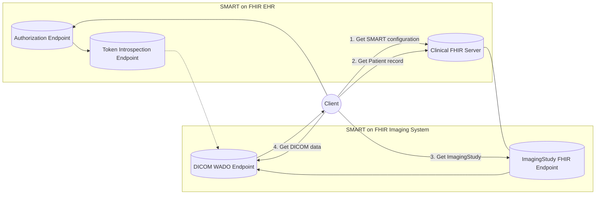
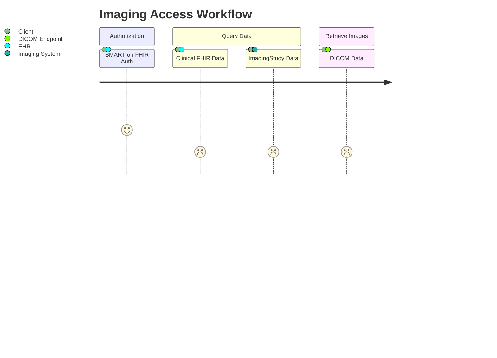
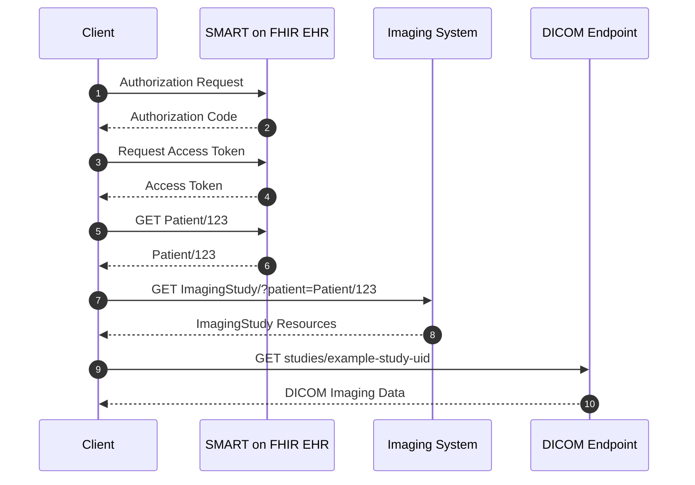
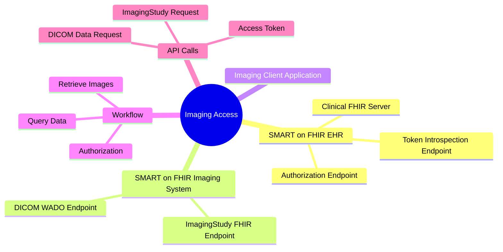
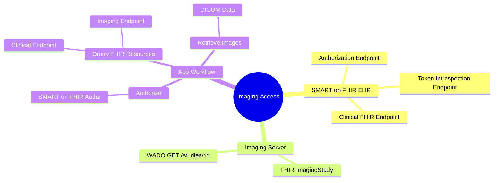

```mermaid
flowchart LR
    subgraph "SMART on FHIR EHR"
        Auth[(Authorization Endpoint)]
        TI[(Token Introspection Endpoint)]
        CFS[(Clinical FHIR Server)]
    end
    subgraph "SMART on FHIR Imaging System"
        IFS[(ImagingStudy FHIR Endpoint)]
        WADO[(DICOM WADO Endpoint)]
    end
    C((Client)) --> Auth
    Auth --> TI
    CFS --- IFS
    IFS --> WADO
    WADO --> C
    C -->|1. Get SMART configuration| CFS
    C -->|2. Get Patient record| CFS
    C -->|3. Get ImagingStudy| IFS
    C -->|4. Get DICOM data| WADO
    TI -.-> WADO
```

```mermaid
journey
  title Imaging Access Workflow
  section Authorization
    SMART on FHIR Auth: 4: Client, EHR
  section Query Data
    Clinical FHIR Data: 2: Client, EHR
    ImagingStudy Data: 2: Client, Imaging System
  section Retrieve Images
    DICOM Data: 2: Client, DICOM Endpoint
```

```mermaid
sequenceDiagram
  participant C as Client
  participant EHR as SMART on FHIR EHR
  participant I as Imaging System
  participant D as DICOM Endpoint
  autonumber
  C->>EHR: Authorization Request
  EHR-->>C: Authorization Code
  C->>EHR: Request Access Token
  EHR-->>C: Access Token
  C->>EHR: GET Patient/123
  EHR-->>C: Patient/123
  C->>I: GET ImagingStudy/?patient=Patient/123
  I-->>C: ImagingStudy Resources
  C->>D: GET studies/example-study-uid
  D-->>C: DICOM Imaging Data
```

```mermaid
mindmap
  root((Imaging Access))
    SMART on FHIR EHR
      Authorization Endpoint
        ::icon(fa fa-lock)
      Token Introspection Endpoint
        ::icon(fa fa-eye)
      Clinical FHIR Server
        ::icon(fa fa-notes-medical)
    SMART on FHIR Imaging System
      ImagingStudy FHIR Endpoint
        ::icon(fa fa-x-ray)
      DICOM WADO Endpoint
        ::icon(fa fa-file-medical)
    Imaging Client Application
      ::icon(fa fa-desktop)
    Workflow
      Authorization
        ::icon(fa fa-shield-alt)
      Query Data
        ::icon(fa fa-search)
      Retrieve Images
        ::icon(fa fa-image)
    API Calls
      Access Token
        ::icon(fa fa-key)
      ImagingStudy Request
        ::icon(fa fa-file-medical-alt)
      DICOM Data Request
        ::icon(fa fa-download)
```

```mermaid
mindmap
  root((Imaging Access))
    SMART on FHIR EHR
      Authorization Endpoint
      ::icon(fa fa-key)
      Token Introspection Endpoint
      ::icon(fa fa-search)
      Clinical FHIR Endpoint
      ::icon(fa fa-file-medical)
    Imaging Server
    ::icon(fa fa-x-ray)
      FHIR ImagingStudy
      WADO GET /studies/:id
    App Workflow
      Authorize
      ::icon(fa fa-key)
        SMART on FHIR Authz
      Query FHIR Resources
      ::icon(fa fa-database)
        Clinical Endpoint
        Imaging Endpoint
      Retrieve Images
      ::icon(fa fa-x-ray)
        DICOM Data
```

