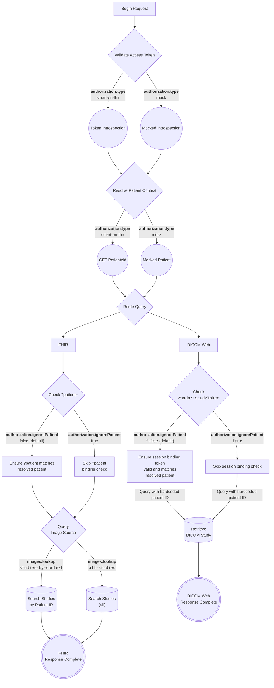
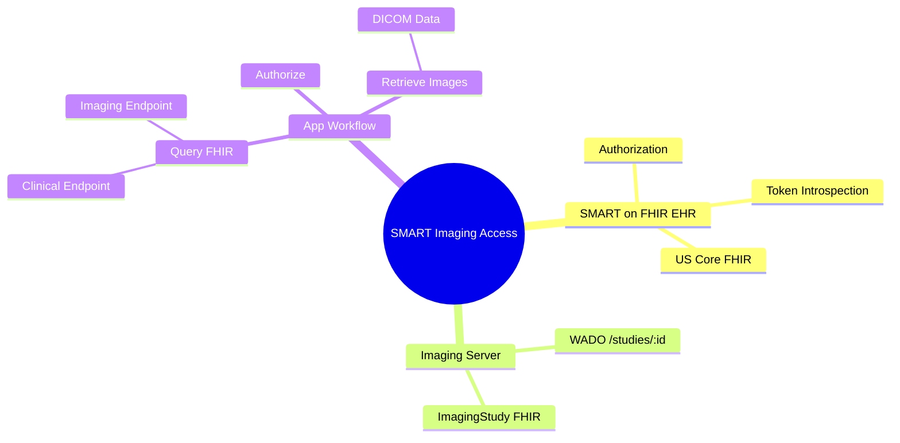
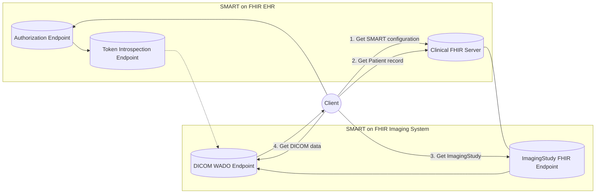
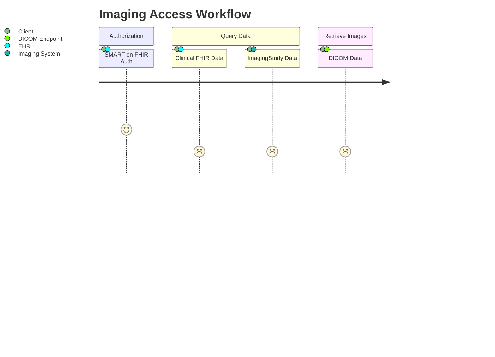
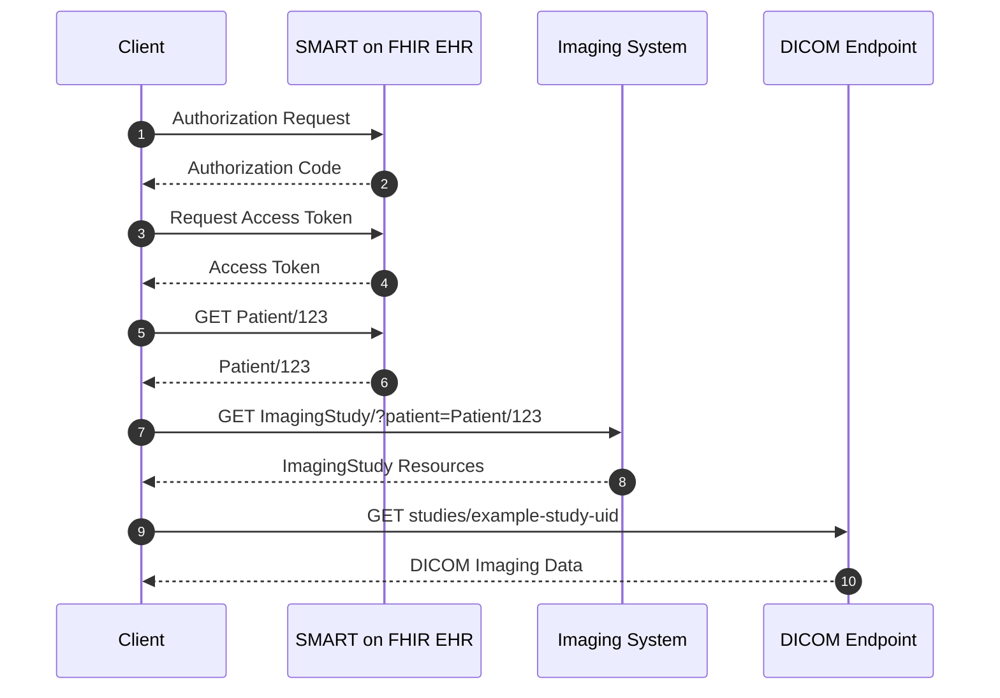

```mermaid
flowchart TB
    A[Begin Request] --> AccessTokenValidation{Validate Access Token}
    AccessTokenValidation -->|<b>authorization.type</b><br>smart-on-fhir| TokenIntrospection((Token Introspection))
    AccessTokenValidation -->|<b>authorization.type</b><br>mock| FakeIntrospection((Mocked Introspection))
    TokenIntrospection --> ResolvePatientContext{Resolve Patient Context}
    FakeIntrospection --> ResolvePatientContext
    ResolvePatientContext -->|<b>authorization.type</b><br>smart-on-fhir| GetPatient((GET Patient/:id))
    ResolvePatientContext -->|<b>authorization.type</b><br>mock| FakeResolver((Mocked Patient))

    GetPatient --> RouteQuery{Route Query}
    FakeResolver --> RouteQuery

    RouteQuery --> FHIRQuery[FHIR]
    RouteQuery --> DICOMQuery[DICOM Web]

    FHIRQuery --> CheckFHIRPatientBinding{Check ?patient=}
    CheckFHIRPatientBinding -->|"<b>authorization.ignorePatient</b><br>false (default)"| EnsurePatientProperty[Ensure ?patient matches<br>resolved patient]
    CheckFHIRPatientBinding -->|<b>authorization.ignorePatient</b><br>true| SkipPatientBindingCheck[Skip ?patient<br>binding check]
    EnsurePatientProperty --> RespondToFHIRQueries{Query<br>Image Source}
    SkipPatientBindingCheck --> RespondToFHIRQueries
    RespondToFHIRQueries -->|"<b>images.lookup</b><br><code>studies-by-context</code>"| PatientBinding[(Search Studies<br>by Patient ID)]
    RespondToFHIRQueries -->|"<b>images.lookup</b><br><code>all-studies</code>"| AllStudiesOnServer[("Search Studies<br>(all)")]

    PatientBinding --> FHIRResponseComplete(((FHIR<br>Response Complete)))
    AllStudiesOnServer --> FHIRResponseComplete

    DICOMQuery --> CheckDICOMSessionBinding{Check<br><code>/wado/:studyToken</code>}
    CheckDICOMSessionBinding -->|"<b>authorization.ignorePatient</b><br><code>false</code> (default)"|CheckSessionBindingToken[Ensure session binding token<br>valid and matches<br>resolved patient]
    CheckDICOMSessionBinding -->|"<b>authorization.ignorePatient</b><br><code>true</code>"| SkipSessionBindingCheck[Skip session binding check]
    CheckSessionBindingToken -->|Query with hardcoded patient ID| DICOMWebResponseGeneration[(Retrieve<br>DICOM Study)]
    SkipSessionBindingCheck -->|Query with hardcoded patient ID| DICOMWebResponseGeneration
    DICOMWebResponseGeneration --> DICOMWebResponseComplete(((DICOM Web<br>Response Complete)))

```

```mermaid
mindmap
  root((SMART Imaging Access))
    SMART on FHIR EHR
      Authorization
      Token Introspection
      US Core FHIR
    Imaging Server
      ImagingStudy FHIR
      WADO /studies/:id
    App Workflow
      Authorize
      Query FHIR
        Clinical Endpoint
        Imaging Endpoint
      Retrieve Images
        DICOM Data
```

```mermaid
flowchart LR
    subgraph "SMART on FHIR EHR"
        Auth[(Authorization Endpoint)]
        TI[(Token Introspection Endpoint)]
        CFS[(Clinical FHIR Server)]
    end
    subgraph "SMART on FHIR Imaging System"
        IFS[(ImagingStudy FHIR Endpoint)]
        WADO[(DICOM WADO Endpoint)]
    end
    C((Client)) --> Auth
    Auth --> TI
    CFS --- IFS
    IFS --> WADO
    WADO --> C
    C -->|1. Get SMART configuration| CFS
    C -->|2. Get Patient record| CFS
    C -->|3. Get ImagingStudy| IFS
    C -->|4. Get DICOM data| WADO
    TI -.-> WADO
```

```mermaid
journey
  title Imaging Access Workflow
  section Authorization
    SMART on FHIR Auth: 4: Client, EHR
  section Query Data
    Clinical FHIR Data: 2: Client, EHR
    ImagingStudy Data: 2: Client, Imaging System
  section Retrieve Images
    DICOM Data: 2: Client, DICOM Endpoint
```

```mermaid
sequenceDiagram
  participant C as Client
  participant EHR as SMART on FHIR EHR
  participant I as Imaging System
  participant D as DICOM Endpoint
  autonumber
  C->>EHR: Authorization Request
  EHR-->>C: Authorization Code
  C->>EHR: Request Access Token
  EHR-->>C: Access Token
  C->>EHR: GET Patient/123
  EHR-->>C: Patient/123
  C->>I: GET ImagingStudy/?patient=Patient/123
  I-->>C: ImagingStudy Resources
  C->>D: GET studies/example-study-uid
  D-->>C: DICOM Imaging Data
```

